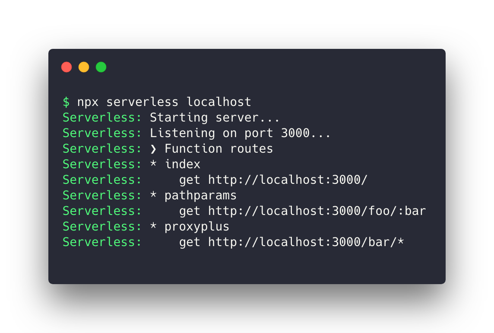

# serverless localhost [](https://travis-ci.org/softprops/serverless-localhost)

> Host __any__ API Gateway triggerable AWS Lambda in __any__ Lambda runtime locally with **no** changes to your serverless application



## Overview

Goals

* 👩‍💻 Shorten AWS Lambda development feedback loops
* ⚡ Integrate with your existing serverless application
* ⛱️ Work with **all** AWS Lambda runtimes out of the box
* 🐑 Leverage [lambci project](https://github.com/lambci/) for undifferentiated heaving lifting

## 📦 Install

> 💡 This plugin relies on Docker to emulate AWS Lambda runtimes. If you don't have docker
installed, you can learn how to do so [here](https://www.docker.com/products/docker-desktop)

Inside a serverless project directory, run the following

```sh
$ npm i -D softprops/serverless-localhost
```

Add `serverless-localhost` to your `serverless.yml` file's
list of `plugins`

```yaml
service: demo
provider:
  name: aws
  runtime: xxx
plugins:
  - serverless-localhost
functions:
  test:
    handler: foo.bar
    events:
      - http:
          path: /
          method: GET
```

## 🤸 Usage

Run the following in your terminal

```sh
$ npx serverless localhost
```

This will start a server accessible via `http://localhost:3000`

To start a server on an alternative port, use the `-p` flag providing the desired
port to listen on

```sh
$ npx serverless localhost -p 3001
```

### 🌏 Environment variables

Environment variables defined in your `serverless.yml` will be made available inside
the localhost server. If your `serverless.yml` is configured to source their
values from the deployment env, i.e. `${env.FOO,''}` just export their values
before starting the server.

```sh
$ FOO=bar npx serverless localhost
```

### 👩‍🔬 Debugging applications

Serverless localhost supports running a subset of lambda runtimes in debugging mode
by starting the server with the debug flag `-d` providing a port for the runtimes debugger to listen on.

```sh
$ npx serverless localhost -d 5858
```

> 💡 Debugging is supported for the following lambda runtimes `nodejs`, `nodejs4.3`, `nodejs6.10`, `nodejs8.10`, `java8`, `python2.7`, `python3.6`, `dotnetcore2.0`, `dotnetcore2.1`

### 🔬 Debugging the plugin

If you find your having a problem with this plugin, you can run this plugin's command
with the `DEBUG` environment variable set to "localhost"

```sh
$ DEBUG=localhost npx serverless localhost
```

### Extending

The serverless [plugin model](https://serverless.com/framework/docs/providers/aws/guide/plugins/)
lets you easily integrate custom workflows with serverless localhost through
"hooking" into plugin lifecycle events.

The erverless localhost plugin emits a `localhost:start` event for which you can
hook into the following lifecycle events some pre/post logic

* `before:localhost:start`
* `after:localhost:start`

## Comparisons

### API Gateway

The target usecase for serverless localhost is to emulate API Gateway triggers locally to facilitate faster feedback loops.
The emulation is currently limited to the `LAMBDA-PROXY` integration, a flavor of integration where API Gateway passes the entire
request to your lambda. This is the most common (and default) use in the serverless community. As such its the focus of this plugin.

This plugins commitment is based on an as-needed/best-effort model. It is not a perfect emulation and as emulation features
are needed they are provided on a best effort basis. The best emulation you will get is no emulation.

### Serverless offline

### Runtimes

[serverless offline](https://github.com/dherault/serverless-offline) is another awesome serverless plugin which for a long time
only focused on the nodejs lambda runtime, it recently added support for Python and Ruby. It's a more mature as its been around for longer
but takes a different approach to emulation. It tries to implement much of the runtime itself. As a result its slow and
sometimes reluctant to support other runtimes.

Serverless localhost takes an alternate approach which enables it to support all runtimes, more faithfully out of the box but leveraging
[lambci projects](https://github.com/lambci/) docker images which are exported copies of the actually AWS Lambda runtimes.  What you get here
is as close as possible emulation of your deployment target and out of the box support for **all** AWS Lambda runtimes which no effort
on behalf of this plugin's contributors.

### Integrations

Serverless offline supports both API Gateway `LAMBDA` and `LAMBDA-PROXY` integrations. As mentioned above, this plugins focus on the more common
and default of serverless framework, `LAMBDA-PROXY`. It's possible `LAMBDA` integration will be added in the the future but **only**
if there is sufficient demand.


## 👯 Contributing

Contributions are welcome. Please read [our contributing doc](CONTRIBUTING.md) for more information.

---

🚧 Planned work

Please not this road is still being paved. The following items are planned work ahead

* add support for binary requests and responses
* debug mod for runtimes

Doug Tangren (softprops) 2019